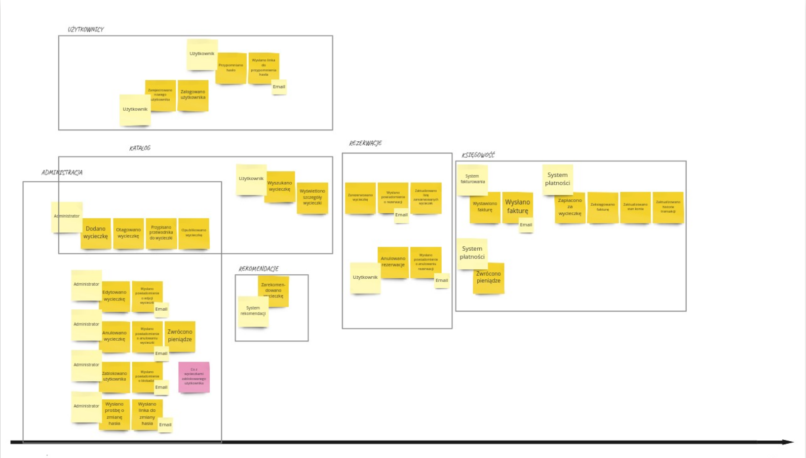
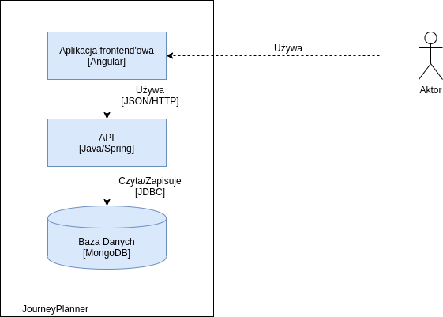
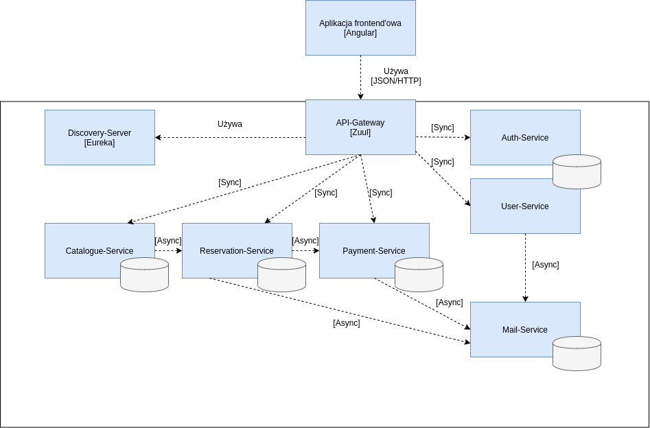
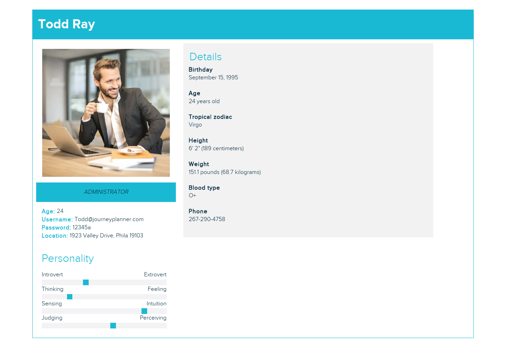
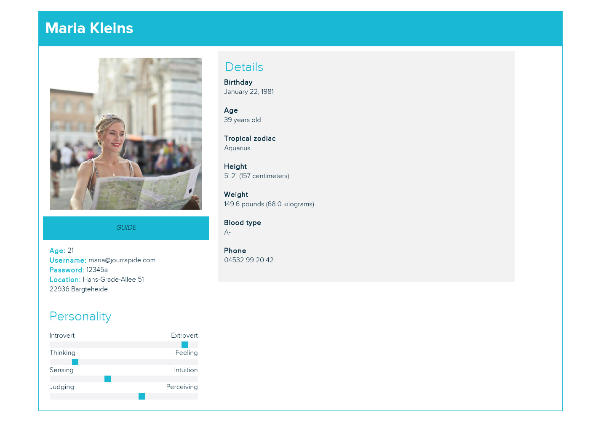
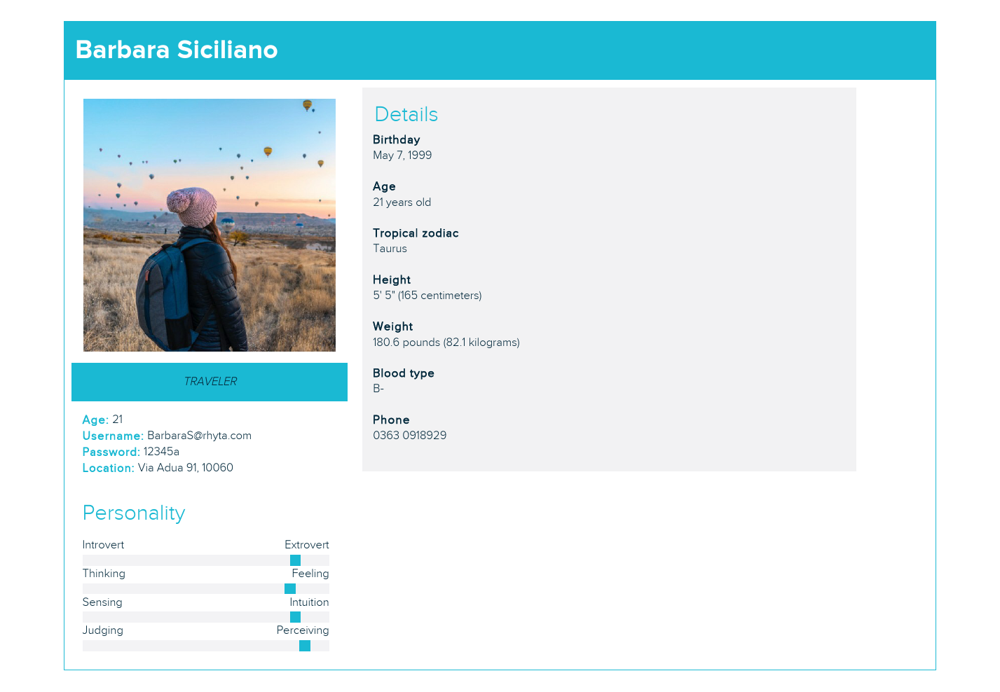

# Studia - Projekt Zespolowy - Backend
## Projekt - System do rezerwacji wycieczek

# Table of contents

1. [Wymagania](#wymagania)
2. [Uruchomienie](#uruchomienie)
3. [Zasoby](#zasoby)
4. [Event Storming - Big Picture](#event-storming---big-picture-event-storming)
5. [Architektura](#architektura)
6. [Agile Personas](#agile-personas)

---
### Wymagania

Do uruchomienia projektu niezbędny jest: `maven` oraz `docker-compose`

---

### Uruchomienie

* Wykonanie skryptu `build.sh`.
* W głównym katalogu projektu wykonanie komendy `docker-compose build`, a następnie `docker-compose up`.

---

### Zasoby

* **MongoDB:**  
host: `locahost` port: `27017`

* **Panel administracyjny RabbitMq:**  
`http://localhost:15672/`  
user: `guest` password: `guest`

* **MailHog:**  
`http://localhost:8025/`

* **Eureka Server:**  
`http://localhost:8761/`

* **Grafan Dashboard:**  
`http://localhost:3000/`  
user: `admin` password: `password`  
plik z dashboard'em: `monitoring/jvm-micrometer_rev8.json`

* **Default Gateway:**  
``http://localhost:8762/``

* **Swagger:**  
``http://localhost:9115/swagger-ui.html``  
``http://localhost:9105/swagger-ui.html``  
``http://localhost:9120/swagger-ui.html``  
``http://localhost:9125/swagger-ui.html``  

---

### Event Storming - Big Picture 

----

### Architektura

#### Diagram: poziom C2

#### Diagram: poziom C3

----

### Agile Personas

Admin:

Username: `Todd@journeyplanner.com`   
Password: `12345a`  

Guide:

Username: `maria@jourrapide.com`   
Password: `12345a`  

User:

Username: `BarbaraS@rhyta.com`   
Password: `12345a`  
